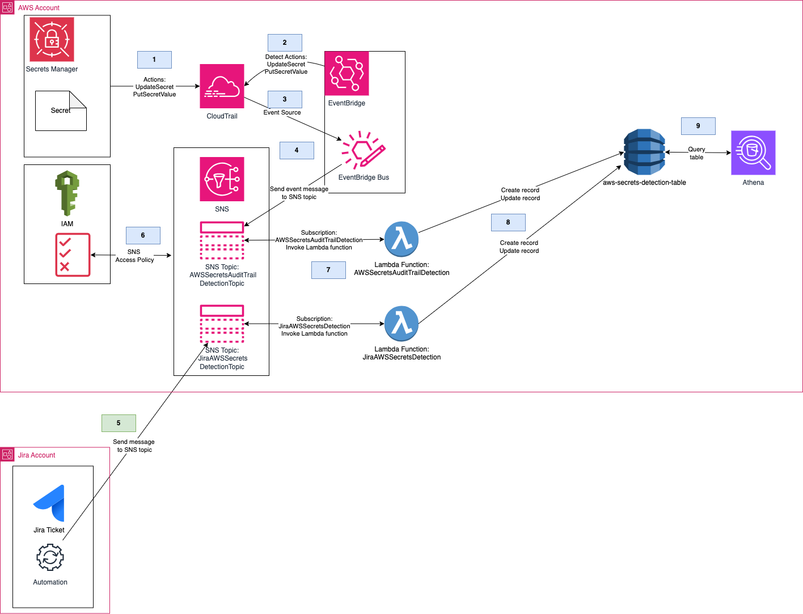

# AWS Secrets Manager integration with Jira
## Detecting AWS Secret changes and Jira ticket integration

## Problem Statement: 
Customer wants to implement a workflow that links changes in AWS Secrets Manager to approved Jira tickets, ensuring changes are audited and approved. The goal is to automate this process, integrate logging (via CloudTrail), and find a reliable method beyond an "honor system" for tracking secret changes and approvals. At high level, creating a seamless workflow that ties together secrets management, audit trails, and change approval processes.

## Application Components



### 
1. AWS Secret Updated or Created: An AWS secret is a confidential data value that can be used to authenticate and authorize access to AWS resources. In this scenario, a secret is updated or created in AWS.
2. CloudTrail records action: CloudTrail is an AWS service that records API actions taken in an AWS account. When a secret is updated or created, CloudTrail records the action as a CloudTrail event. 
3. EventBridge detects Secret change and sends message to SNS topic: EventBridge is a serverless event bus that connects applications and services with data from a variety of sources. It detects the CloudTrail event for the secret update or creation and sends an message to an SNS topic. 
4. SNS Topic validates IAM policy to receive message: The SNS topic has an IAM policy attached to it that defines who can receive messages from the topic. The Lambda function that creates the DynamoDB record checks the IAM policy to ensure it has the necessary permissions to send the message to the SNS topic. 
5. User creates Jira ticket and Jira automation pushes SNS message to AWS SNS topic: A user creates a Jira ticket for a problem or issue they are facing. Jira automation is configured to push a message to an AWS SNS topic when a new Jira ticket is created. 
6. SNS Topic validates IAM policy to receive message: The SNS topic has an IAM policy attached to it that defines who can receive messages from the topic. The Lambda function that creates the DynamoDB record checks the IAM policy to ensure it has the necessary permissions to send the message to the SNS topic. 
7. SNS topic invokes Lambda function: The SNS topic invokes the Lambda function, which processes the secret update or creation event and creates a DynamoDB record. 
8. Lambda function creates DynamoDB record: The Lambda function creates a DynamoDB record with the details of the secret update or creation event, such as the secret name, value, and ARN. 
8. Users accesses Amazon Athena to queries DynamoDB table looking for discrepancies in updates: Athena is an AWS service that enables users to analyze large amounts of data stored in Amazon S3 using SQL. In this scenario, Athena is used to query the DynamoDB table to check for discrepancies in the updates made to the secret.
### 

## Requirements

- [Create an AWS account](https://portal.aws.amazon.com/gp/aws/developer/registration/index.html) if you do not already have one and log in. The IAM user that you use must have sufficient permissions to make necessary AWS service calls and manage AWS resources.
- [AWS CLI](https://docs.aws.amazon.com/cli/latest/userguide/install-cliv2.html) installed and configured
- [Git Installed](https://git-scm.com/book/en/v2/Getting-Started-Installing-Git)
- [AWS CDK](https://docs.aws.amazon.com/cdk/latest/guide/cli.html) installed and configured
- [AWS Athena Setup](https://docs.aws.amazon.com/athena/latest/ug/setting-up.html)

## Prequisites

You will need to setup three environment variables before deploying application.  Below are the environment variables that will need to be setup. 

#### Environment Variables
- CDK_DEFAULT_ACCOUNT //The AWS account that solution will be deployed to
- CDK_DEFAULT_REGION  // The AWS region that the solution will be deployed to
- AWS_PRINCIPAL_ORG_ID // You will need to be using AWS Organizations since many acccounts may need to write to a centralized event bus for AWS Secret changes.  For reference https://docs.aws.amazon.com/IAM/latest/UserGuide/reference_policies_condition-keys.html#condition-keys-principalorgid
- DYNAMODB_TABLE_NAME  // The name you want to use for the DynamoDB table.  You can make it aws-secrets-detection-table.

 An example running on a linux based operating is provided below:
```bash
export CDK_DEFAULT_ACCOUNT=12345678910
export CDK_DEFAULT_REGION=us-east-1
export AWS_PRINCIPAL_ORG_ID=o-xxxxxxxxxxx
export DYNAMODB_TABLE_NAME=aws-secrets-detection-table
```


The `cdk.json` file tells the CDK Toolkit how to execute your app.

This project is set up like a standard Python project.  The initialization
process also creates a virtualenv within this project, stored under the `.venv`
directory.  To create the virtualenv it assumes that there is a `python3`
(or `python` for Windows) executable in your path with access to the `venv`
package. If for any reason the automatic creation of the virtualenv fails,
you can create the virtualenv manually.

To manually create a virtualenv on MacOS and Linux:

```
$ python3 -m venv .venv
```

After the init process completes and the virtualenv is created, you can use the following
step to activate your virtualenv.

```
$ source .venv/bin/activate
```

If you are a Windows platform, you would activate the virtualenv like this:

```
% .venv\Scripts\activate.bat
```

Once the virtualenv is activated, you can install the required dependencies.

```
$ pip install -r requirements.txt
```

At this point you can now synthesize the CloudFormation template for this code.

```
$ cdk synth
```

To add additional dependencies, for example other CDK libraries, just add
them to your `setup.py` file and rerun the `pip install -r requirements.txt`
command.

## Useful commands

 * `cdk ls`          list all stacks in the app
 * `cdk synth`       emits the synthesized CloudFormation template
 * `cdk deploy`      deploy this stack to your default AWS account/region
 * `cdk diff`        compare deployed stack with current state
 * `cdk docs`        open CDK documentation


## Integrating Jira events to AWS
For information on linking Jira to AWS SNS refer to this guide
https://support.atlassian.com/jira-service-management-cloud/docs/integrate-with-amazon-sns/

### Updating AWS Lambda aws-secrets-detection function
Depending what JIRA fields you'll be using to send AWS SNS messages you may need to update the AWS Lambda function.  In the Lambda folder you will see a sample event named test-event-jira-to-sns.json to understand the payload being sent from Jira to SNS.


